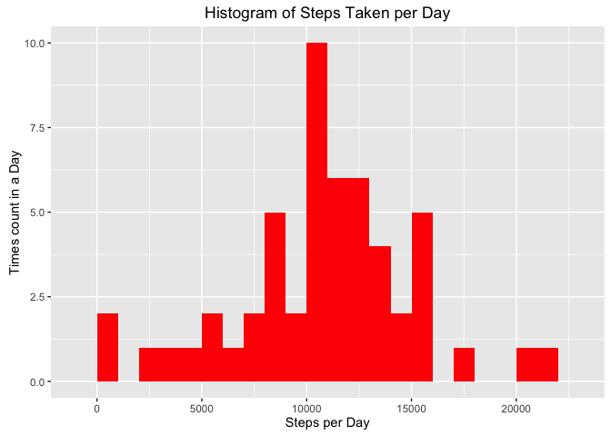
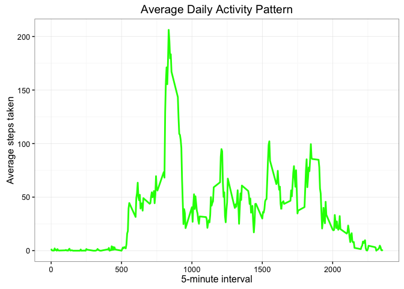
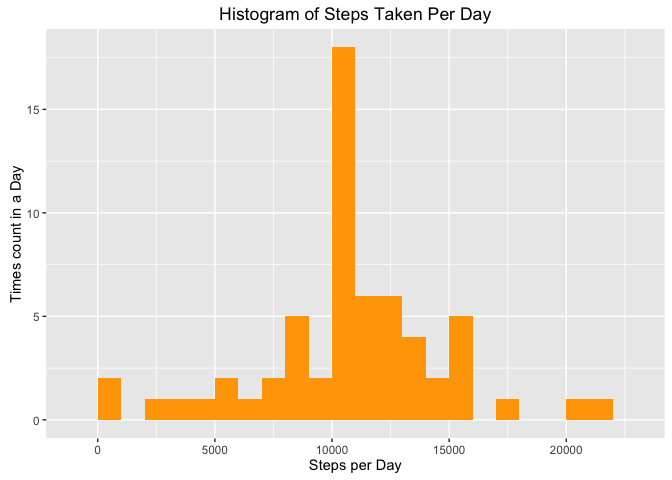
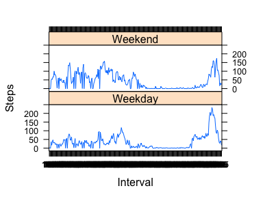

Load libraries
---------------------------------------------
Loading needed libraries

```r
library(knitr)
library(ggplot2)
library(lattice)
```
Loading and preprocessing the data
---------------------------------------------

```r
activity <- read.csv("activity.csv", header = TRUE, sep = ",", colClasses = c("numeric", "Date", "factor"))
```
What is mean total number of steps taken per day?
----------------------------------------------
Calculate the total number of steps taken per day

```r
stepsPerDay <- aggregate(steps ~ date, activity, sum)
```
Create the histogram

```r
ggplot(stepsPerDay, aes(x = steps)) + geom_histogram(fill = "red", binwidth = 1000) + 
        labs(title = "Histogram of Steps Taken per Day", 
             x = "Steps per Day", y = "Times count in a Day")
```

\
Calculate the mean and median of the total number of steps taken per day and report them

```r
stepsMean <- mean(stepsPerDay$steps, na.rm = TRUE)
stepsMean
```

```
## [1] 10766.19
```

```r
stepsMedian <- median(stepsPerDay$steps, na.rm = TRUE)
stepsMedian
```

```
## [1] 10765
```
What is the average daily activity pattern?
--------------------------------------------------------
Calculate the steps per interval and covert the interval as integers

```r
stepsPerInterval <- aggregate(activity$steps, by = list(interval = activity$interval), FUN = mean, na.rm = TRUE)
stepsPerInterval$interval <- as.integer(levels(stepsPerInterval$interval)[stepsPerInterval$interval])
colnames(stepsPerInterval) <- c("interval", "steps")
```
Create a time series plot of the 5-minute interval (x-axis) and the average number of steps taken (y-axis)

```r
ggplot(stepsPerInterval, aes(x = interval, y = steps)) + geom_line(color = "green", size = 1) +
        labs(title = "Average Daily Activity Pattern",
             x = "5-minute interval", y = "Average steps taken") + theme_bw()
```

\
Calculate the interval which contains the maximum number of steps

```r
maxStepsInterval <- stepsPerInterval[which.max(stepsPerInterval$steps), ]
maxStepsInterval
```

```
##     interval    steps
## 272      835 206.1698
```
Imputing missing values
-----------------------------------------------------
Calculate the total number of NA in the dataset

```r
totalNA <- sum(is.na(activity$steps))
totalNA
```

```
## [1] 2304
```
Fill in all of missing values in the dataset

```r
stepsAverage <- aggregate(steps ~ interval, data = activity, FUN = mean)
fillNA <- numeric()
for (i in 1:nrow(activity)) {
        obs <- activity[i, ]
        if (is.na(obs$steps)) {
                steps <- subset(stepsAverage, interval == obs$interval)$steps
        } else {
                steps <- obs$steps
        }
        fillNA <- c(fillNA, steps)
}
```
Create a new dataset tha is equal to the original dataset but with the NA filled in

```r
noNAactivity <- activity
noNAactivity$steps <- fillNA
noNAstepsPerDay <- aggregate(steps ~ date, noNAactivity, sum)
```
Create a histogram of the total number of steps taken each day

```r
ggplot(noNAstepsPerDay, aes(x = steps)) + geom_histogram(fill = "orange", binwidth = 1000) + 
        labs(title = "Histogram of Steps Taken Per Day", x = "Steps per Day", y = "Times count in a Day")
```

\
Calculate the mean and median of total number of steps taken per day and report them

```r
meanStepsNoNA <- mean(noNAstepsPerDay$steps, na.rm = TRUE)
meanStepsNoNA
```

```
## [1] 10766.19
```

```r
medianStepsNoNA <- median(noNAstepsPerDay$steps, na.rm = TRUE)
medianStepsNoNA
```

```
## [1] 10766.19
```
The values do differ slightly from before

Are there differences in activity patterns between weekdays and weekends?
-----------------------------------------------------

```r
daysOfWeek <- weekdays(activity$date)
dayLevel <- vector()
for (i in 1:nrow(activity)) {
        if (daysOfWeek[i] == "Sabato") {
                dayLevel[i] <- "Weekend"
        } else if (daysOfWeek[i] == "Domenica") {
                dayLevel[i] <- "Weekend"
        } else {
                dayLevel[i] <- "Weekday"
        }
}
activity$dayLevel <- dayLevel
activity$dayLevel <- factor(activity$dayLevel)
stepsByDay <- aggregate(steps ~ interval + dayLevel, data = activity, mean)
names(stepsByDay) <- c("interval", "dayLevel", "steps")
```
Create a panel plot containing a time series plot of the 5-minute interval (x-axis) and the average number of steps taken, across all weekday days or weekend days (y-axis)

```r
xyplot(steps ~ interval | dayLevel, stepsByDay, type = "l", layout = c(1, 2), xlab = "Interval", ylab = "Steps")
```

\
